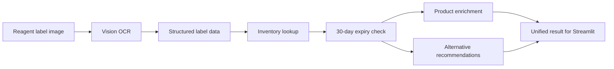

# LabMind

**An AI-assisted laboratory inventory manager for reagent-label recognition, expiry alerts, and alternative product recommendations.**

LabMind turns a laboratory label image into a structured inventory result. The current backend MVP extracts label fields, checks inventory, detects expiring items, enriches supplier information, and recommends reviewed alternatives through one stable Python interface.

> Project status: Backend MVP complete. Streamlit UI, OCR evaluation, and team integration are in progress.

## MVP Workflow



## Current Features

- Structured OCR fields: catalog number, lot number, expiry date, brand, product name, and confidence.
- Mock mode for local development without billable API calls.
- Live vision mode for the official OpenAI endpoint.
- Optional UniVibe-compatible provider path with a Chat Completions fallback.
- Case-insensitive inventory and product lookup by catalog number.
- Expiry-date normalization and configurable warning windows.
- Detection of mismatches between photographed and stored expiry dates.
- Rule-based alternative recommendations enriched with supplier information.
- Stable, JSON-ready response objects for UI integration.
- Graceful error results instead of uncaught UI-breaking exceptions.
- Automated tests for OCR, provider configuration, schemas, repositories, expiry logic, and the full pipeline.

## Repository Structure

```text
ENGIN170E/
|-- backend/
|   |-- vision_service.py          # Vision prompt and structured OCR
|   |-- vision_gateway.py          # Provider-aware API gateway
|   |-- provider_config.py         # Safe provider configuration
|   |-- schemas.py                 # Shared response models
|   |-- inventory_service.py       # Inventory lookup
|   |-- expiry_service.py          # Expiry warnings and mismatch logic
|   |-- product_service.py         # Supplier product enrichment
|   |-- recommendation_service.py  # Alternative product lookup
|   `-- pipeline.py                # End-to-end analyze_label entry point
|-- tests/                         # Automated unit and integration tests
|-- products.csv                   # Supplier product catalog
|-- inventory.csv                  # Simulated laboratory inventory
|-- alternatives.csv               # Reviewed compatibility mappings
|-- sample_output.json             # Example pipeline response
|-- requirements.txt
`-- .env.example                   # Credential-free configuration template
```

## Quick Start

### 1. Clone the repository

```bash
git clone https://github.com/Waterfa258/ENGIN170E.git
cd ENGIN170E
```

### 2. Create a virtual environment

Windows PowerShell:

```powershell
python -m venv .venv
.venv\Scripts\Activate.ps1
```

macOS or Linux:

```bash
python3 -m venv .venv
source .venv/bin/activate
```

### 3. Install dependencies

```bash
python -m pip install -r requirements.txt
```

### 4. Create local configuration

Windows PowerShell:

```powershell
Copy-Item .env.example .env.local
```

macOS or Linux:

```bash
cp .env.example .env.local
```

The default configuration uses `mock` mode and does not make a live API request.

## Run the Backend Pipeline

Provide a non-empty `.jpg`, `.jpeg`, `.png`, or `.webp` image path:

```python
import json

from backend.pipeline import analyze_label

result = analyze_label("path/to/reagent-label.jpg", mode="mock")
print(json.dumps(result.to_dict(), indent=2))
```

Mock mode still validates that the image exists and uses a supported format, but it returns deterministic OCR data for safe local UI development.

## Live API Configuration

Never commit `.env.local` or a real API key. The repository ignores local credentials by default.

### Official OpenAI endpoint

Edit `.env.local`:

```dotenv
LABMIND_VISION_MODE=live
LABMIND_PROVIDER=openai
OPENAI_API_KEY=your_openai_api_key
OPENAI_MODEL=gpt-4o
```

The backend pins OpenAI credentials to the official `https://api.openai.com/v1` endpoint.

### Optional UniVibe-compatible endpoint

UniVibe is a third-party provider and requires its own provider-issued key. Do not reuse an official OpenAI key with a third-party endpoint.

```dotenv
LABMIND_VISION_MODE=live
LABMIND_PROVIDER=univibe
UNIVIBE_API_KEY=your_univibe_api_key
UNIVIBE_BASE_URL=https://api.univibe.cc/openai/v1
UNIVIBE_MODEL=your_supported_model
```

## Streamlit Integration

The UI only needs the public pipeline entry point:

```python
from backend.pipeline import analyze_label

result = analyze_label(image_path)
payload = result.to_dict()
```

The returned payload includes:

- `status`
- `ocr`
- `inventory`
- `expiry_warning`
- `alternatives`
- `product`
- `expiry_mismatch`
- `image_expiry`
- `inventory_expiry`
- `error_message`

See [`sample_output.json`](sample_output.json) for a complete example.

## Data Files

| File | Current size | Purpose |
|---|---:|---|
| `products.csv` | 20 records | Supplier specifications, prices, and product links |
| `inventory.csv` | 20 records | Simulated quantities, locations, and expiry dates |
| `alternatives.csv` | 6 mappings | Reviewed original-to-alternative compatibility rules |

Alternative mappings are recommendations for the academic prototype and should be reviewed by qualified laboratory personnel before real-world use.

## Testing

Run the complete test suite from the repository root:

```bash
python -m unittest discover -s tests
```

Current result: **43 tests passing**.

## Team Responsibilities

- **CS A:** Vision API integration, backend logic, schemas, and automated tests.
- **CS B:** Streamlit UI, GitHub coordination, and deployment.
- **AI teammate:** OCR prompt design, failure analysis, and accuracy evaluation.
- **Data and domain teammates:** Product data, inventory data, compatibility rules, and visualization.

## Roadmap

- [x] Backend service architecture and stable response schemas
- [x] Mock and live vision-provider paths
- [x] Inventory, expiry, product, and alternative logic
- [x] Automated backend tests
- [ ] Evaluate OCR Prompt 1.0 on labeled test images
- [ ] Build and connect the Streamlit UI
- [ ] Run end-to-end tests with new label images
- [ ] Add evaluation charts and query logging
- [ ] Add email alerts and purchase-order generation

## Security and Scope

- Keep credentials only in `.env.local`.
- Never upload unredacted sensitive laboratory labels.
- Use separate credentials for official OpenAI and third-party providers.
- Treat the current system as an academic MVP, not a validated laboratory safety or procurement system.

